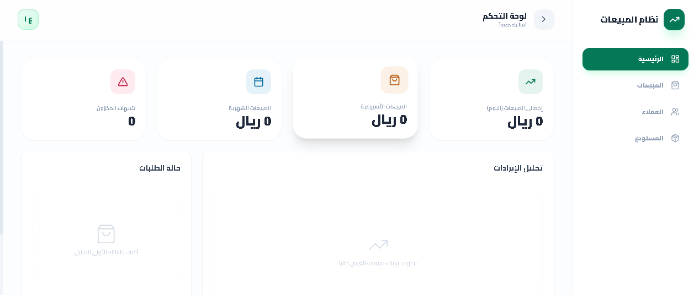

<h1 align="center">نظام إدارة المبيعات</h1>

لوحة تحكم حديثة لإدارة وتحليل بيانات المبيعات

---

## 📸 واجهة النظام

---

# 📌 وصف المشروع

هذا المشروع عبارة عن واجهة أمامية (Front-End) لنظام إدارة المبيعات تم تطويرها باستخدام تقنيات حديثة بهدف تنظيم وتحليل بيانات المبيعات بطريقة واضحة وسهلة الاستخدام.

يساعد النظام على:

- عرض بيانات المبيعات بشكل منظم
- تحليل الأداء المالي
- متابعة العملاء والمنتجات
- عرض تقارير ورسوم بيانية
- تقديم تحليلات ذكية باستخدام الذكاء الاصطناعي

المشروع مهيأ ليتم ربطه لاحقًا مع Back-End وقاعدة بيانات.

---

# ⭐ المميزات

- لوحة تحكم شاملة Dashboard
- إدارة المبيعات والطلبات
- إدارة العملاء
- إدارة المنتجات والمخزون
- البحث داخل العملاء والطلبات
- فلترة البيانات
- رسوم بيانية تفاعلية
- تصدير التقارير إلى PDF
- دعم اللغة العربية و RTL
- تصميم حديث ومتجاوب

---

# 🔎 البحث والفلترة

يوفر النظام إمكانية البحث والفلترة داخل البيانات مثل:

- البحث عن العملاء
- البحث عن الطلبات
- فلترة الطلبات حسب الحالة
- عرض البيانات حسب 

---

# 🤖 الذكاء الاصطناعي

يعتمد النظام على Google Gemini AI لتحليل بيانات لوحة التحكم وتقديم:

- ملخص لأداء المبيعات
- اقتراحات لتحسين الدخل
- تحليل سلوك العملاء

---

# 🛠️ التقنيات المستخدمة

- React
- TypeScript
- Vite
- Tailwind CSS
- Google Gemini AI
- html2pdf.js

---

# 🚀 التطوير المستقبلي

سيتم تطوير المشروع لاحقًا ليشمل:

- ربط Back-End API
- إضافة قاعدة بيانات
- نظام تسجيل دخول
- تخزين دائم للبيانات
- تقارير مالية متقدمة

---

# 👩‍💻 المطور
ولاء عوض
